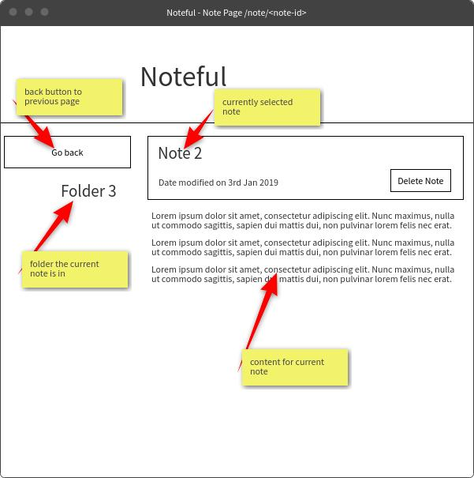

# Part 1  
___  

### Assignment
You're going to build an application called **Noteful**. This application will be built up over several checkpoints as we first create the design and basic components with routing, and then move onto integrating the API calls. We'll also be building the back-end for this application in the Node curriculum!

To start, create a new `create-react-app` project called `noteful` and remove the boilerplate code to have a clean starting point.

This assignment is to build the basic components for 3 routes based off of the wireframes we'll supply below. You don't need to implement any API calls or functionality to manage the notes just yet as we'll get to that in later checkpoints.

#### Requirements

There are 3 routes to build: the main route, the dynamic folder route, and a dynamic note route. We'll supply you with 3 wireframes for each of these pages and you'll then need to create the semantic (accessible) HTML for these as well as basic styling.

- Each route should have a header, main section, and a sidebar section

- Every route will have the same header section, the app's title should be a link to the main route

- The state will be supplied below in a JSON object and contains an array of `folders` and an array of `notes`

    - Set the state inside the main App component (we'll use an API call to populate this state in a future checkpoint)

- The **main** route:

    - Should be displayed when the path is /
    - The main section will display all of the available notes
        - Each note should show its name and modified date
    - The sidebar will display a list of folders with none selected

- The dynamic **folder** route:

    - Should be displayed when the path is `/folder/<with-a-folder-id-here>`
    - The `folder-id` will reference an id of one of the folders in state
    - The main section should display only the notes that are "in" the selected folder
    - The sidebar should display the folder list with the selected folder highlighted

- The dynamic **note** route:

    - Should be displayed when the path is /note/<with-a-note-id-here>
    - The note-id will reference an id of one of the notes in state
    - The main section should display the currently selected notes name, modified date and content
    - The sidebar should display the folder of the currently selected note as well as a "back" button.

This assignment is the biggest one for your React journey so far and should take about 4 hours to complete. If you're having trouble, attend a Q&A session or reach out on Slack for help.

#### Dummy data

Use this **[dummy-store.js](https://gist.github.com/tomatau/a1686a9af624dd39f753de8ce90fd345)** as a file in your project to populate the initial state.

#### Wireframes

The main route:


The folder route:


The note route:



#### Hints

Hints for the App component:

- Use sets of Route components: one set for the main content and another set for the sidebar. Each set of routes can be configured using the same paths, but different components. For example:
```javascript
function Example() {
  return <>
    <Sidebar>
      <Route path='/' component={MainSidebar} />
      <Route path='/foo' component={FooSidebar} />
    </Sidebar>
    <Main>
      <Route path='/' component={MainMain} />
      <Route path='/foo' component={FooMain} />
    </Main>
  </>
}
```

- In order to pass props into components for specific routes, you'll need to use the `render` prop on `Route` components in a similar way to when we added programmatic navigation to the bookmarks app. For example:
```javascript
<Route
  path='/foo'
  render={(routerProps) =>
    <FooSidebar
      aFoo={this.state.foos.find(foo => foo.id === routeProps.match.params.foodId)}
    />
  }
/>
```

- The main route and the folder route could use the same component with a different list of notes passed in as props.

The folder route:

- Instead of using `Link` components in the sidebar for each folder, you can use the React-Router `NavLink` component that will automatically add a `className` of `"active"` when appropriate.
- You'll need to filter for the notes that contain a matching `folderId` to the folder that's selected when deciding which notes to display.

___
___
___

# Part 2
___

### Assignment
For this assignment, you'll refactor your `noteful` project to use React context for displaying folders and notes. Once you've refactored to context, you'll implement an API request for fetching the folders and notes. You'll also implement the delete buttons to make API calls and update context accordingly.

#### Requirements

1. Refactor your Noteful application to use context instead of prop-drilling.
2. Implement two fetch requests to two endpoints when the application mounts: `/folders` and `/notes`. Store the response from these requests using a `setState` in whichever component you were keeping your dummy state.
3. Implement the delete button for each note in the list in the **main** route and **folder** route.
4. Implement the delete button on the **note** page, if the delete is successful, redirect to the `/` path.
5. The API calls will be made to a local server called `noteful-json-server` that you'll need to have running separately to your `noteful` React application.
> You aren't required to implement the "add-folder" or "add-note" forms just yet.

This assignment combines many advanced concepts from previous checkpoints so take your time! It should take about 2 hours to complete. If you're having trouble, attend a Q&A session or reach out on Slack for help!

##### Noteful JSON server

To get your local copy of the noteful API, clone this project into your local projects folder.

```bash
git clone https://github.com/tomatau/noteful-json-server
cd ./noteful-json-server
npm install
npm start
# Ctrl-c to close the server
```
- You can see documentation for the JSON-server once it's started by visiting `http://localhost:9090`.
- You can see all of the data currently stored in the server by visiting `http://localhost:9090/db`.

To fetch the notes and folders, you should make two GET requests:

- `http://localhost:9090/folders`
- `http://localhost:9090/notes`

To delete notes, make a DELETE request to the `/notes/<note-id>` endpoint.

##### Hints

- You'll be able to swap the `render` props in your `Route` components for `component` props as the nested components can read the values from context directly.
- You may need to swap some function components for class components so that you can read context (or use `Context.Consumer` components with render props).
- To add the content type header in fetch requests you can pass in an "init" object with settings. Here's an example for a DELETE request:
```javascript
fetch(`http://localhost:1234/foo/${fooId}`, {
  method: 'DELETE',
  headers: {
    'content-type': 'application/json'
  },
})
```
- You can implement the DELETE request in the component that owns the delete button, and then use a callback context value to update the state in your top level component.
- After making a successful DELETE request, you can use a `this.state.notes.filter` method along with `setState` to remove a note from state and update context.

___
___
___

# Part 3
___

### Assignment
In this assignment you will build upon the Noteful application that you started in the previous lesson. You will add two forms for POSTing new folders and new Notes to the server. You will also add error boundaries at appropriate places in the structure. Finally you will refactor the components to use PropTypes to validate the props.

#### Requirements
1. Create a new component `AddFolder` that implements a form to capture the name of a new folder from the user. This form should submit the name of the new folder to the `POST /folders` endpoint on the server. Ensure that any errors are properly handled. Add a button to the navigation to invoke the new form.
2. Create a new component `AddNote` that implements a form to capture the name, content and folder for a new Note. Submit to the `POST /notes` endpoint on the server. Add validation to ensure that the name of the note is not left blank. The folder should be selected from a list of existing folders. Ensure that errors are properly handled. Add a button to the note list page to invoke this new form.
3. Define an error boundary component. Add this component to specific points in your component structure.
4. Review each of the components that you have built so far for this project. Any component that receives props from its parent should be refactored to define `PropType` validation.
